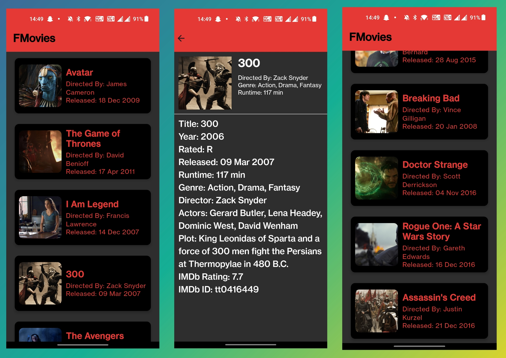

# FMovies - Your Ultimate Movie Companion 🎬
### FMovies is a delightful movies app crafted with Kotlin Jetpack Compose, bringing a seamless and engaging experience to movie enthusiasts. Dive into the world of cinema with a user-friendly interface and explore movies effortlessly.

## Features 🌟
- List View with LazyColumn: Discover a curated list of movies presented in an intuitive LazyColumn layout for a smooth browsing experience.

- Detailed Movie Information: Click on any movie card to explore in-depth details about your favorite films on the Details Screen.

- Jetpack Compose Magic: Built with the power of Kotlin Jetpack Compose, FMovies leverages modern UI development techniques for a sleek and dynamic user interface.

## Screenshots 📸
<!-- Add your captivating screenshots here to showcase the stunning UI of your FMovies app. -->

### Getting Started 🚀
Follow these simple steps to get FMovies up and running on your local machine.

### Clone the repository:

bash

Copy code

git clone https://github.com/your-username/FMovies.git

Open the project in Android Studio.

Build and run the app on your preferred emulator or device.

## How to Contribute 🤝
We welcome contributions to enhance the FMovies app. If you have new features to propose, bug fixes, or any improvements, feel free to open an issue or create a pull request.

## License 📜
This project is licensed under the MIT License - see the LICENSE file for details.

## Acknowledgments 👏
A big shoutout to the Kotlin Jetpack Compose team for providing an amazing toolkit for modern Android UI development.

Enjoy your movie journey with FMovies! 🍿🎉

## Sample Video-

https://github.com/MrFarhanKhan007/FMovies/assets/96666465/e32ef0d1-21e4-44b1-bb37-6f4ef5ccc608

